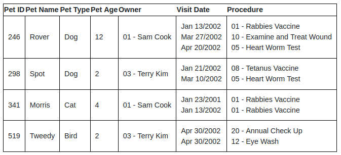
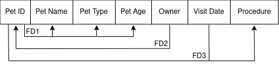
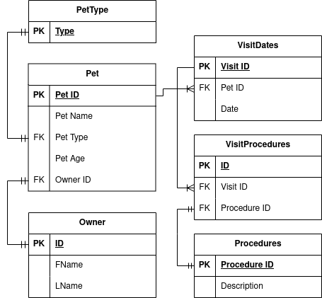

# Exercise: Normalization
***In this exercise you will practice normalizing the relations of a database. For this particular exercise we will use a relation for a Pet Health Clinic. The relation is shown below:***  

  

# Find the primary key
***For the Pet Health Clinic relation, find the primary key. If there is no primary key, explain why.***    
The primary key is the Pet ID column, as this is a unique identifier for the pet.   
In the case of a siamese, or conjoined twins pet, the primary key still fulfills the desired constraint of uniquely identifying the pet. (Even with two or more heads, names, and owners.)

  

# Diagram
***Draw a diagram of the Pet Health Clinic relation. Use the diagram to identify the functional dependencies in the relation. Make assumptions where necessary.***

  

# Normalize
***Decompose the relations into 3NF. Write down a few keywords to explain your trail of thought.***
* Pet <-> PetType & Pet <-> Owner are 1-to-1 relation.
* Pet -> VisitDates is one-to-many relation.
* VisitDates -> VisitProcedures is one-to-many relation.
* VisitProcedures <-> Procedures is 1-to-1 relation.

1NF: Simple atomic values.  
2NF: Fully functionally dependent on primary key.   
3NF: No transitive dependencies. (No potential candidate keys within relation.)

  

# Decomposition
***Are all functional dependencies preserved in the decomposition? If not, explain why.***  
The Owner to Pet ID functional dependency seems like a logical starting point for the relations hierarchy. 
However, when decomposing into 3NF it becomes apparent that a potential 1-to-many relation (Owner -> Pet),
can be simplified to a 1-to-1 relation, by putting the topmost point of the relations hierarchy on the Pet relation 
(Owner ID on the Pet table).
Besides this decision, the functional dependencies are preserved.
